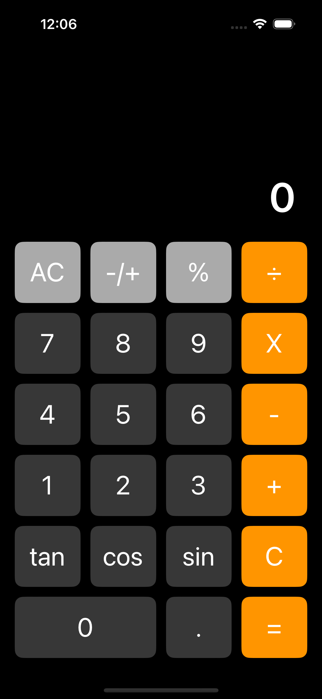

# myCalculator

`myCalculator` is the main app that serves as a simple and user-friendly calculator built using SwiftUI.

## CoreCalculator Framework

`CoreCalculator` is an Objective-C framework that provides essential arithmetic operations like addition, subtraction, multiplication, division, trigonometric functions (sine, cosine, tangent), and more. It is embedded into the `myCalculator` SwiftUI app, allowing seamless interaction between the app's user interface and the underlying logic.

## Build Process

To combine the simulator and iOS framework build, a custom script file was created. This script automates the build process and ensures the proper combination of resources from the simulator and iOS framework. A copy of the script file is included in the repository for reference.

## How It Works

The `CoreCalculator` framework is embedded within the `myCalculator` app. This allows the SwiftUI-based interface to leverage the mathematical operations defined in the Objective-C framework, providing users with a responsive and efficient calculator.

## Design

The design of the app is kept minimalistic and functional, ensuring that the user experience remains intuitive and straightforward. Buttons are neatly aligned, and the interface adapts to both portrait and landscape orientations.

## Features

- Basic arithmetic operations: Addition, subtraction, multiplication, and division.
- Advanced trigonometric functions: Sine, cosine, and tangent.
- Error handling for division by zero.
- The ability to take and save screenshots of the current calculator display.

## Screenshot Feature

To save a screenshot of the calculator display:

1. Tap the desired screen.
2. Use the screenshot feature built into iOS (e.g., press the Power and Volume Up buttons simultaneously) to capture the current state of the app.

### Screenshots

#### Portrait Mode

#### Landscape Mode

## Resources Used

- **ChatGPT**: Used for suggestions and guidance during development.
- **Stack Overflow**: A valuable resource for resolving issues and finding code solutions.
- **Canvas**: Used for creating the app logo.

## Conclusion

`myCalculator` is a simple yet powerful calculator app built with a clean design, designed to handle both basic and advanced mathematical operations. It demonstrates how Objective-C frameworks can be used seamlessly within a modern SwiftUI app.
